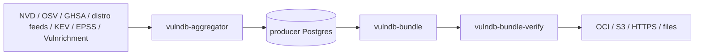
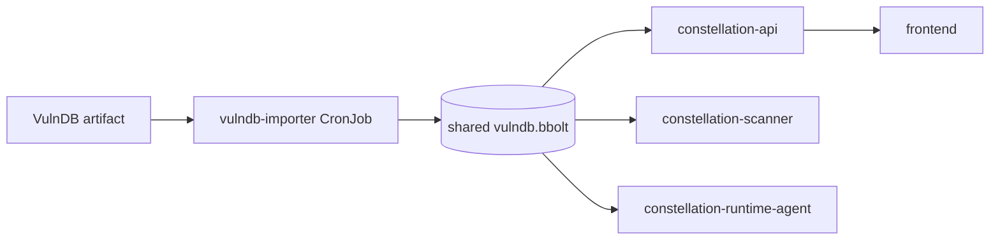
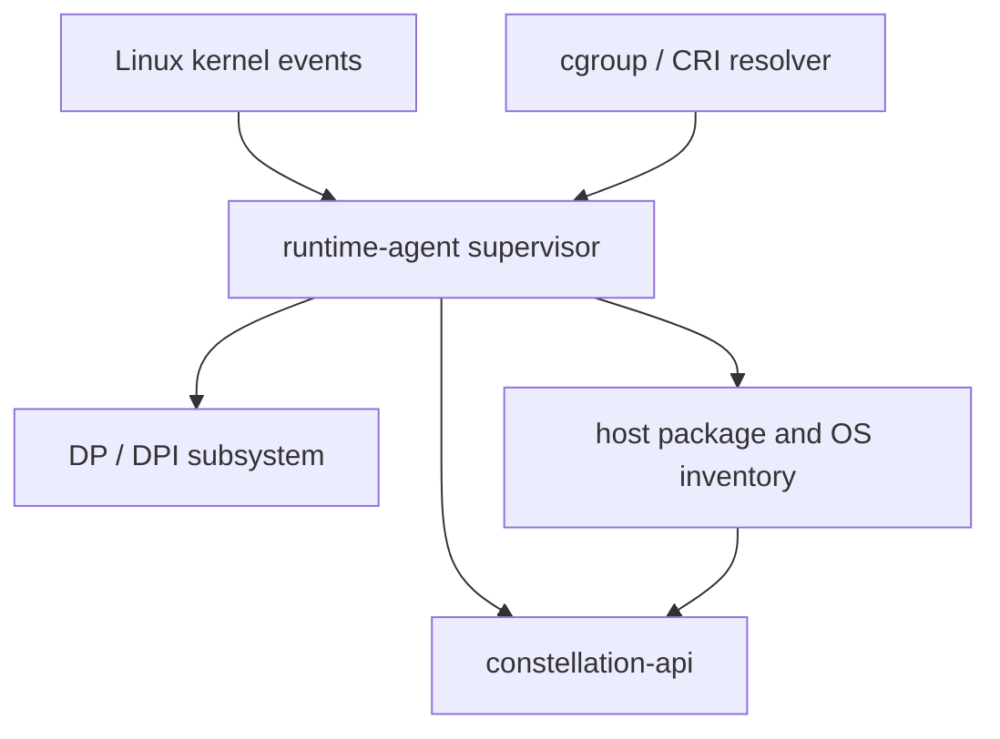
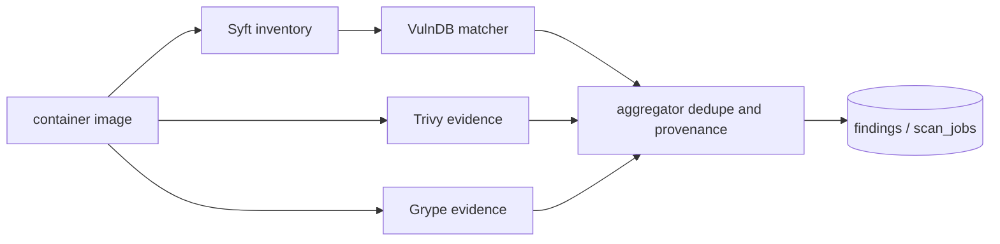
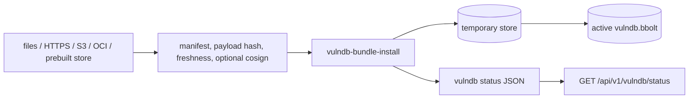

# Architecture

Constellation is greenfield until the first stable release. The current
architecture is intentionally allowed to change when correctness, security, or
operability improves. Product-facing paths documented here should either be
implemented and tested, explicitly marked future-scope, or listed in
`../CONSTELLATION_NEUVECTOR_VULNDB_REVIEW_PLAN.md` as remaining validation.

## VulnDB Producer

`constellation-vulndb` is the vulnerability-intelligence producer. It ingests
upstream sources, normalizes them into schema v2 records, builds signed bundle
artifacts, and publishes artifacts that Constellation or other products can
consume.

## Constellation Consumer

Constellation consumes released VulnDB artifacts. API, scanner, runtime-agent,
and importer roles share the same materialized local store but keep write
responsibility isolated to the importer or explicitly enabled manual upload.

## Runtime Agent And Data Plane

The runtime-agent is the node-local enforcement role. It collects host and
container context, resolves container identity through cgroup/CRI state when
available, and supervises runtime enforcement components. The NeuVector-derived
data-plane code remains a deliberately isolated native subsystem.

## Scanner Flow

Syft is the package inventory source. VulnDB is the canonical vulnerability
matcher. Trivy and Grype remain optional evidence engines for reconciliation,
not the source that owns canonical advisory identity when VulnDB reports a
matching advisory/package key.

### Scan Schema Baseline (v1)

This is the canonical, frozen baseline for the scan domain as of migration `092`.
It is documentation, not a migration: the tables already exist in the migration
chain (`db/migrations/`) and are NOT being rewritten here. The point is to make
future churn visible against a written baseline. The scan domain has historically
been the churniest part of the schema (`scan_jobs` accreted ALTERs across
`008,028,034,054,057,062,066,081,084`; `image_scan_artifacts` created in `068`
then ALTERed in `069–072`), and it overlaps the largest handler files, so any
further column add/drop in these tables should be reviewed against this list
before merge.

`scan_jobs` (control-plane → scanner-worker queue) canonical columns:

- Identity/ownership: `id`, `org_id`, `image_ref`, `platform`, `requested_by`.
- Lifecycle: `status` (`pending|running|completed|failed|paused|canceled`),
  `worker_id`, `error`, `requested_at`, `claimed_at`, `finished_at`,
  `paused_at`, `canceled_at`, `resumed_at`.
- Retry accounting: `attempt_count`, `max_attempts`, `next_attempt_at`,
  `last_attempt_at`, `next_retry_at`.
- Result rollups: `package_count`, `finding_count`.
- Provenance/bundle: `bundle_metadata` (JSONB), `vulndb_bundle_version`,
  `trust_policy_id`.
- Targeting: `target_id`, `scan_target_id`, `target_type`, `target_ref`,
  `target_cluster_id`.

`image_scan_artifacts` (per-scan result rows: SBOM/secret/signature/layer/
file-risk artifacts) is the sibling churn hotspot; its base table is `068` and the
artifact-type tables live in `069–072`. Its FK/constraint set is rebuilt
defensively (drop-if-exists then re-add) in those migrations, which is the
mechanical source of the high ALTER count — not genuine schema redesign.

Gate: changes to `scan_jobs` / `image_scan_artifacts` columns or constraints
require review against this baseline. Prefer new sibling tables over more ALTERs
on these two.

## Importer And Update Flow

The importer installs a verified artifact into a local bbolt store atomically.
Artifact sources can be mounted files, HTTPS/S3, OCI, a prebuilt store, or an
explicit manual upload path for development and emergency operation.

## Change Boundary

Stable now:

- VulnDB producer and Constellation consumer are separate repositories.
- Constellation consumes public `constellation-vulndb/pkg/*` packages.
- VulnDB bundle artifacts are durable; local bbolt stores are materialized
  runtime artifacts.
- VulnDB owns canonical vulnerability matching when enabled.
- Trivy and Grype are optional evidence engines.

Subject to change before first stable release:

- Runtime-agent and DP process boundaries.
- Future Astronomer reverse-tunnel protocol shape.
- Exact release evidence packaging.
- Live e2e matrix details for Docker/BuildKit, kind/k3s, and CNI enforcement.
